# Cisco Packet Tracer Static Routing Lab

## Overview

This project demonstrates how to build and configure a basic routed network in **Cisco Packet Tracer** using two PCs, two switches, and two routers. The goal of the lab was to allow devices on two different LANs to communicate with each other by assigning IP addresses, configuring router interfaces, and adding static routes.

This lab helped reinforce core networking concepts such as IP addressing, default gateways, router interface configuration, and static routing.

## Lab Objective

The objective was to connect **PC1** and **PC2** across separate networks and verify end-to-end communication using `ping`.

At the beginning of the lab, both PCs were physically connected to switches and routers, but they could not communicate across networks because routing had not been configured yet. After configuring the router interfaces and adding static routes, both PCs were able to successfully ping each other.

## Network Topology

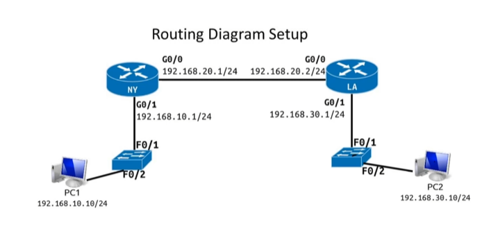

## Devices Used

| Device   | Purpose                                                           |
| -------- | ----------------------------------------------------------------- |
| PC1      | End device on the 192.168.10.0/24 network                         |
| PC2      | End device on the 192.168.30.0/24 network                         |
| Switch 1 | Connects PC1 to Router 1                                          |
| Switch 2 | Connects PC2 to Router 2                                          |
| Router 1 | Routes traffic between PC1's LAN and the router-to-router network |
| Router 2 | Routes traffic between PC2's LAN and the router-to-router network |

## IP Addressing Table

| Device   | Interface          |    IP Address |   Subnet Mask | Default Gateway |
| -------- | ------------------ | ------------: | ------------: | --------------: |
| PC1      | FastEthernet0      | 192.168.10.10 | 255.255.255.0 |    192.168.10.1 |
| PC2      | FastEthernet0      | 192.168.30.10 | 255.255.255.0 |    192.168.30.1 |
| Router 1 | GigabitEthernet0/1 |  192.168.10.1 | 255.255.255.0 |             N/A |
| Router 1 | GigabitEthernet0/0 |  192.168.20.1 | 255.255.255.0 |             N/A |
| Router 2 | GigabitEthernet0/1 |  192.168.30.1 | 255.255.255.0 |             N/A |
| Router 2 | GigabitEthernet0/0 |  192.168.20.2 | 255.255.255.0 |             N/A |

## Configuration Steps

### 1. Connected the Network Devices

I connected PC1 and PC2 to their switches, then connected each switch to its router. The routers were also connected to each other to allow communication between the two separate LANs.

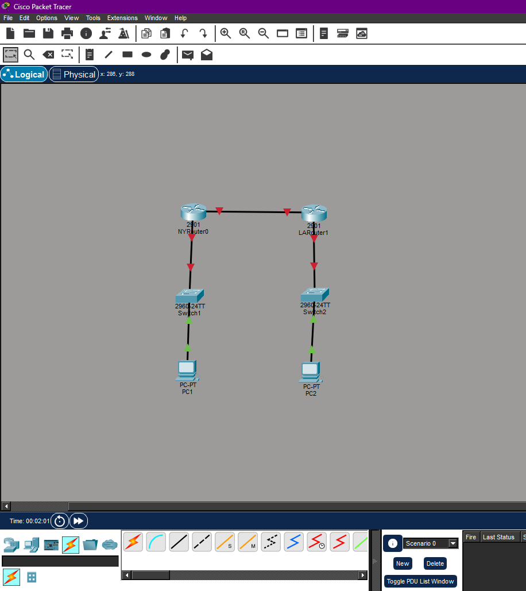

At this point, the PC-to-switch connections were active, but the router links were still down because the router interfaces had not been configured or enabled yet.

### 2. Configured PC1

PC1 was assigned a static IPv4 address on the `192.168.10.0/24` network.

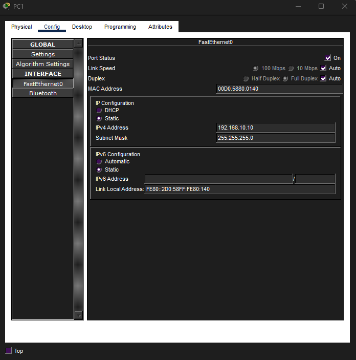

PC1's default gateway was set to Router 1's LAN interface.

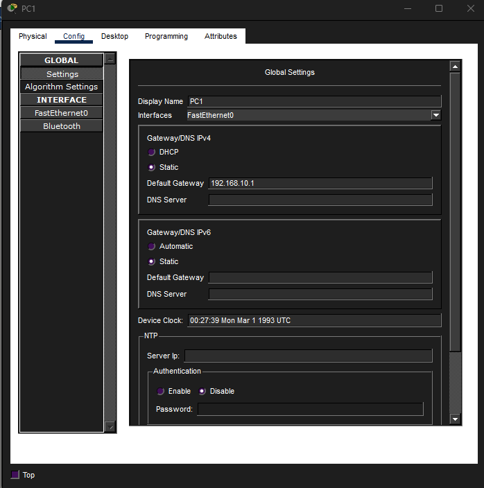

### 3. Configured PC2

PC2 was assigned a static IPv4 address on the `192.168.30.0/24` network.

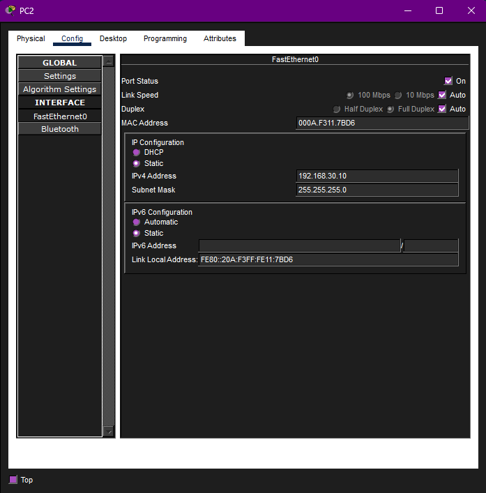

PC2's default gateway was set to Router 2's LAN interface.

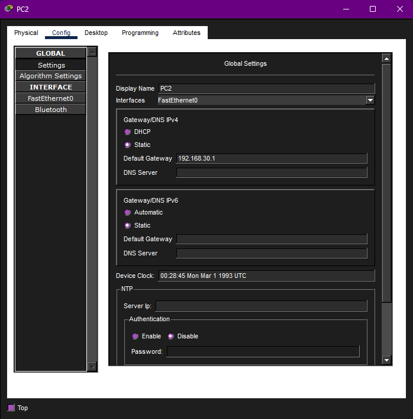

### 4. Configured Router 1 Interfaces

Router 1 needed an IP address on both its LAN-facing interface and its router-to-router interface.

```bash
enable
configure terminal

interface g0/1
ip address 192.168.10.1 255.255.255.0
no shutdown
exit

interface g0/0
ip address 192.168.20.1 255.255.255.0
no shutdown
exit
```

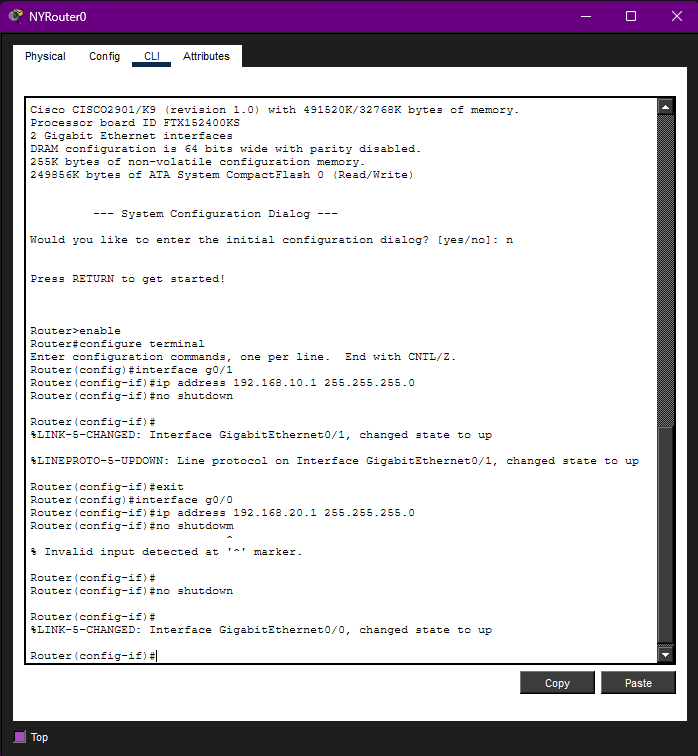

### 5. Configured Router 2 Interfaces

Router 2 also needed an IP address on both its LAN-facing interface and its router-to-router interface.

```bash
enable
configure terminal

interface g0/1
ip address 192.168.30.1 255.255.255.0
no shutdown
exit

interface g0/0
ip address 192.168.20.2 255.255.255.0
no shutdown
exit
```

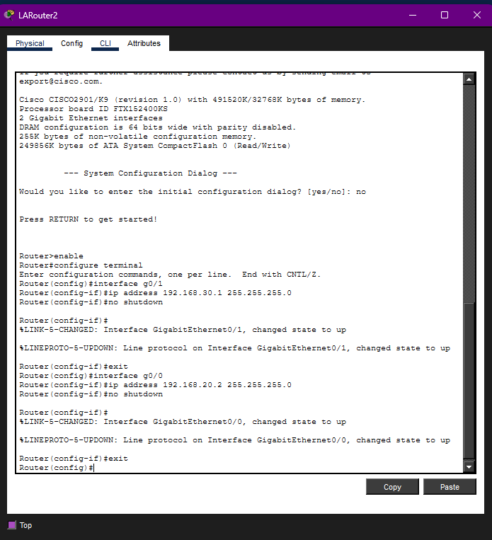

After the router interfaces were configured and enabled, the network links turned green.

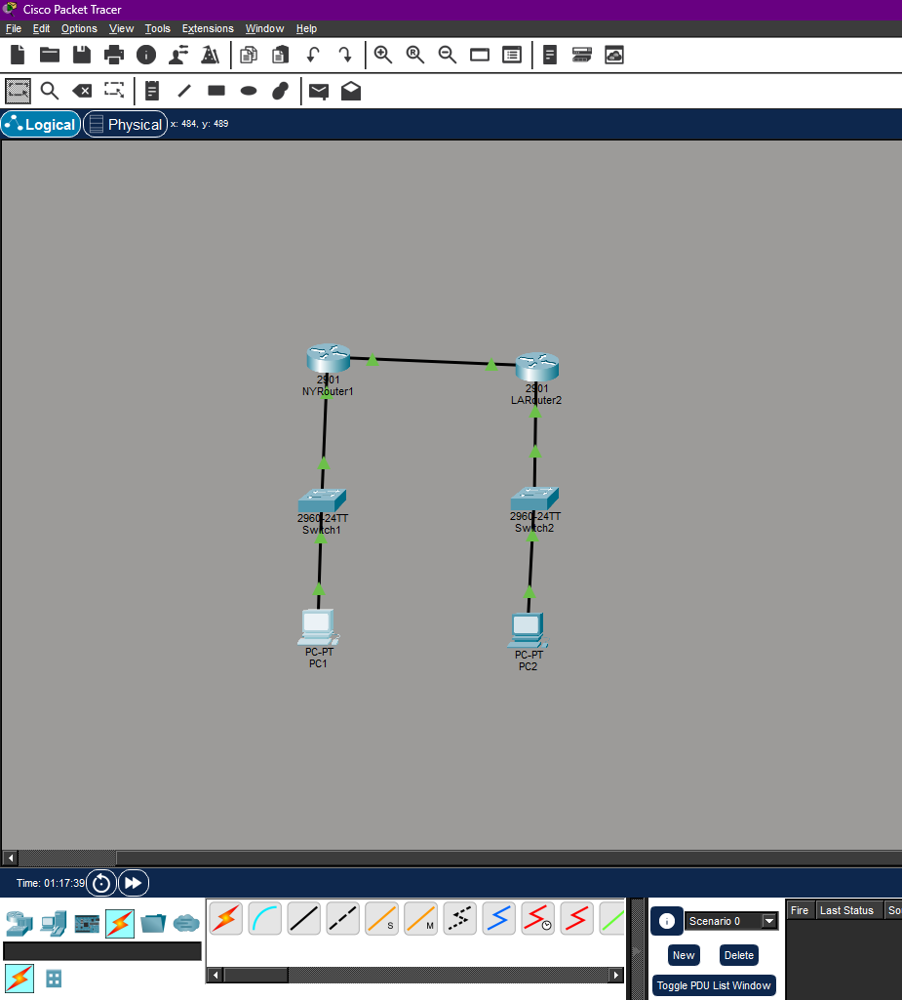

### 6. Tested Connectivity Before Routing

Before adding static routes, PC1 and PC2 were still unable to communicate because each router only knew about its directly connected networks.

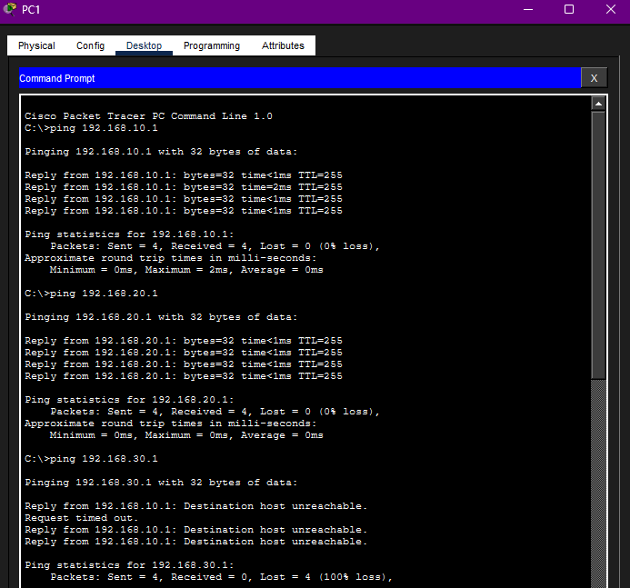

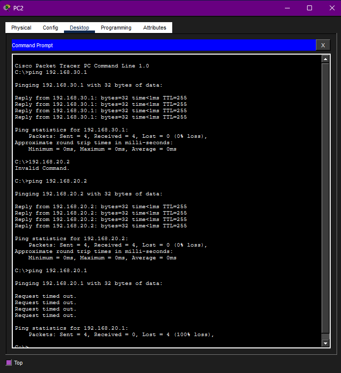

This confirmed that the physical connections and IP addressing were not enough by themselves. Routing still needed to be configured.

### 7. Added Static Routes

To allow Router 1 to reach PC2's network, I added a static route pointing to Router 2.

```bash
enable
configure terminal
ip route 192.168.30.0 255.255.255.0 192.168.20.2
```

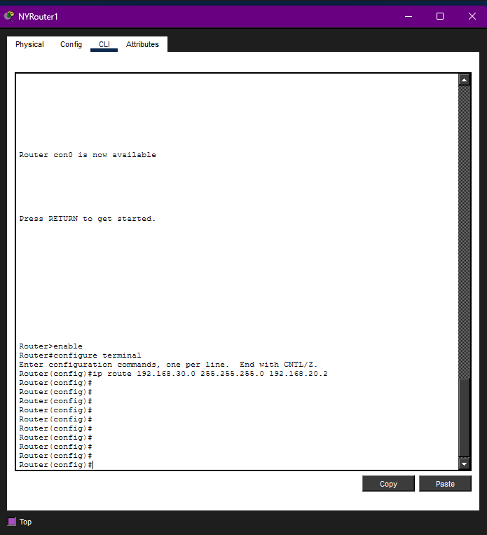

To allow Router 2 to reach PC1's network, I added a static route pointing to Router 1.

```bash
enable
configure terminal
ip route 192.168.10.0 255.255.255.0 192.168.20.1
```

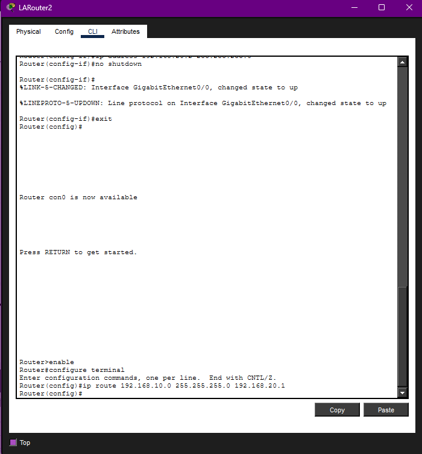

## Verification

After configuring the static routes, I tested connectivity again using `ping`.

PC1 was able to successfully communicate with PC2.

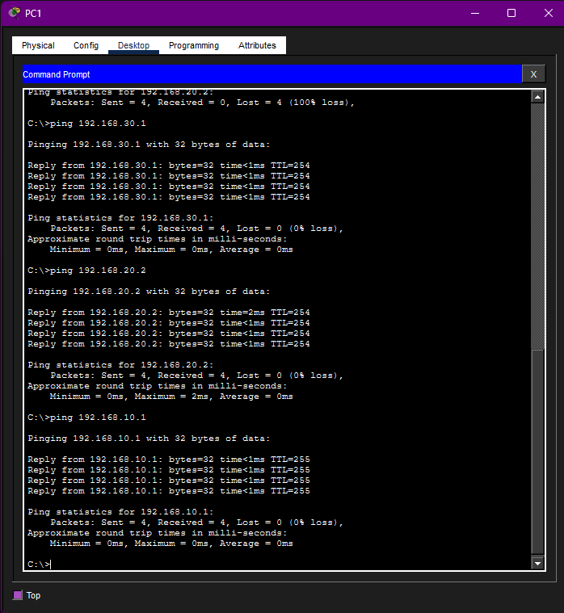

PC2 was also able to successfully communicate with PC1.

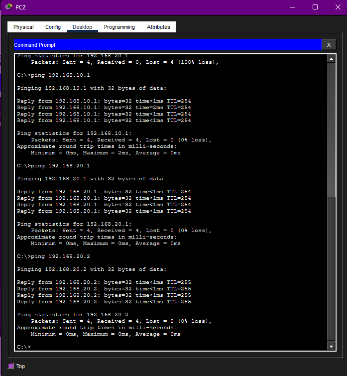

## Troubleshooting Notes

During testing, the PCs could not communicate at first because routing had not been configured. The routers knew only their directly connected networks, so traffic destined for the remote LAN had no route.

The issue was resolved by adding static routes on both routers:

* Router 1 needed a route to `192.168.30.0/24`
* Router 2 needed a route to `192.168.10.0/24`

Once both routes were added, end-to-end communication worked successfully.

## Skills Demonstrated

* Cisco Packet Tracer network setup
* IPv4 addressing
* Subnet mask configuration
* Default gateway configuration
* Router interface configuration
* Static routing
* Basic network troubleshooting
* Connectivity testing with `ping`

## Key Takeaways

This lab showed that devices on separate networks cannot communicate unless routing is properly configured. Even when cables, switches, routers, and IP addresses are set up correctly, routers still need routes to remote networks.

Static routing is a simple way to manually define those paths in smaller networks. This project helped build a stronger understanding of how routers forward traffic between different subnets.

## Security and Ethics Notice

This project was completed in a simulated lab environment using Cisco Packet Tracer. No real systems, public networks, or unauthorized devices were scanned or accessed.
