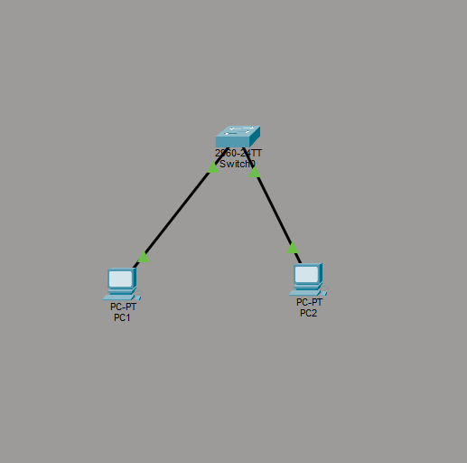
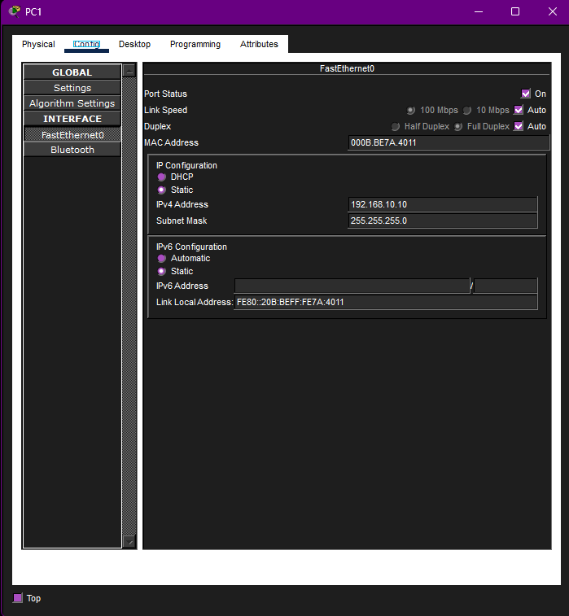
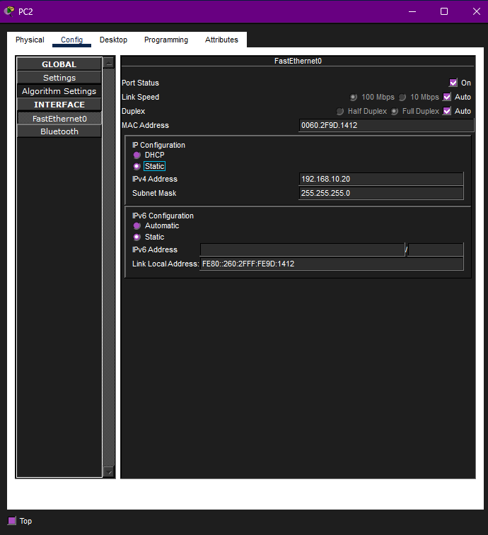
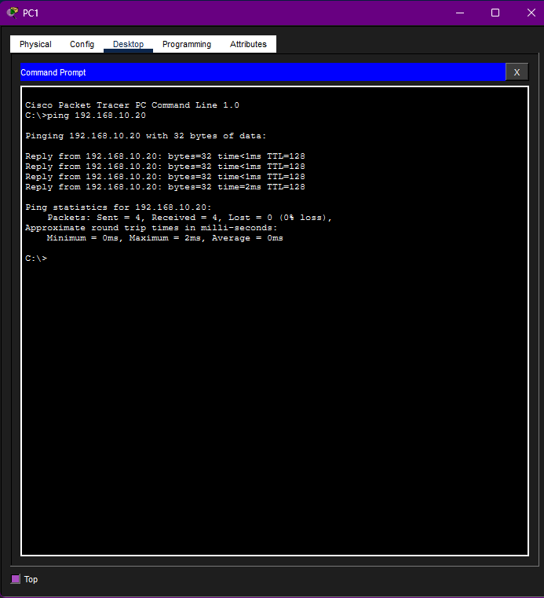
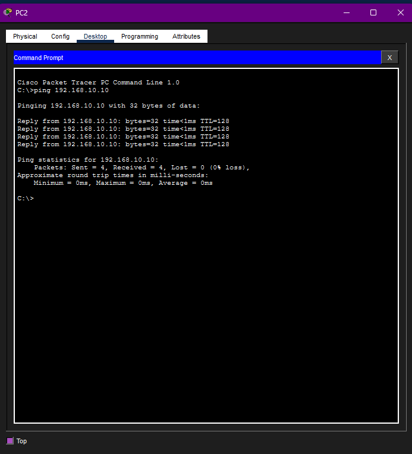
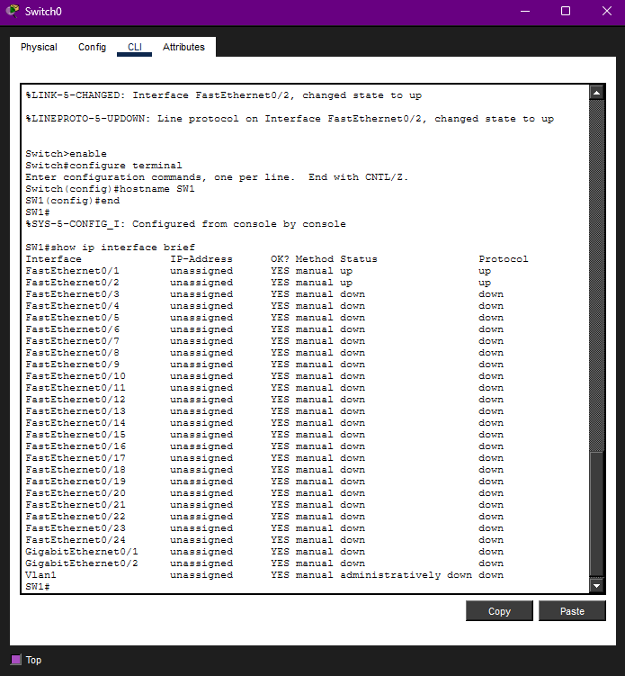
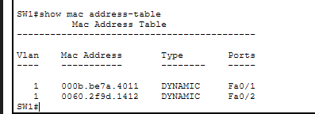
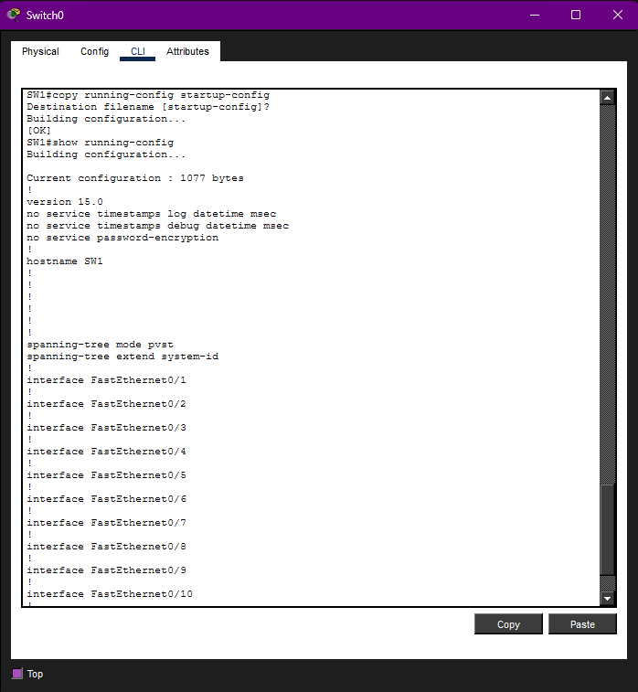

# Basic Switching Lab

## Overview

This lab demonstrates how to build a basic LAN in **Cisco Packet Tracer** using two PCs connected through a switch. The goal was to assign static IP addresses to both PCs, verify that they could communicate on the same subnet, configure a basic switch hostname, and confirm that the switch learned the devices' MAC addresses.

This lab focuses on foundational switching concepts and same-network communication. No router was required because both end devices were placed on the same local network.

## Lab Objective

The objective of this lab was to connect two end devices to a switch and verify communication between them using `ping`.

By the end of the lab, both PCs were able to successfully communicate with each other through the switch.

## Network Topology



## Devices Used

| Device | Purpose |
|---|---|
| PC1 | End device on the LAN |
| PC2 | End device on the LAN |
| Switch0 / SW1 | Layer 2 switch used to connect both PCs |

## IP Addressing Table

| Device | Interface | IP Address | Subnet Mask | Default Gateway |
|---|---|---:|---:|---:|
| PC1 | FastEthernet0 | 192.168.10.10 | 255.255.255.0 | Not required |
| PC2 | FastEthernet0 | 192.168.10.20 | 255.255.255.0 | Not required |

Both PCs were placed in the same subnet, so a default gateway was not needed for this lab.

## Configuration Steps

### 1. Built the Network Topology

I created a simple LAN topology with two PCs connected to a switch.

The connections used were:

| Connection | Cable Type |
|---|---|
| PC1 FastEthernet0 to Switch FastEthernet0/1 | Copper straight-through |
| PC2 FastEthernet0 to Switch FastEthernet0/2 | Copper straight-through |

### 2. Configured PC1

PC1 was assigned a static IPv4 address on the `192.168.10.0/24` network.



### 3. Configured PC2

PC2 was also assigned a static IPv4 address on the same subnet.



### 4. Tested Connectivity from PC1 to PC2

After both PCs were configured, I tested connectivity from PC1 to PC2 using the `ping` command.

```bash
ping 192.168.10.20
```

The ping was successful, confirming that PC1 could communicate with PC2 through the switch.



### 5. Tested Connectivity from PC2 to PC1

I also tested connectivity in the opposite direction by pinging PC1 from PC2.

```bash
ping 192.168.10.10
```

The ping was successful, confirming two-way communication between both PCs.



### 6. Configured the Switch Hostname

I accessed the switch CLI and changed the hostname from the default switch name to `SW1`.

```bash
enable
configure terminal
hostname SW1
end
```

After changing the hostname, I verified the switch interface status.

```bash
show ip interface brief
```

The output showed that `FastEthernet0/1` and `FastEthernet0/2` were up, confirming that both PCs were connected to active switch ports.



### 7. Verified the MAC Address Table

I checked the switch MAC address table to confirm that the switch learned the MAC addresses of PC1 and PC2.

```bash
show mac address-table
```

The output showed dynamically learned MAC addresses on `Fa0/1` and `Fa0/2`, which confirms that the switch identified which device was connected to each port.



### 8. Saved and Verified the Configuration

Finally, I saved the running configuration to startup configuration so the switch settings would remain after a reload.

```bash
copy running-config startup-config
```

I also used `show running-config` to verify the basic switch configuration.

```bash
show running-config
```



## Verification Results

| Test | Result |
|---|---|
| PC1 pinged PC2 | Successful |
| PC2 pinged PC1 | Successful |
| Switch hostname changed to SW1 | Successful |
| Switch ports Fa0/1 and Fa0/2 showed up/up | Successful |
| MAC address table showed learned addresses | Successful |
| Configuration saved | Successful |

## Troubleshooting Notes

At first, communication between devices depends on correct physical connections and correct IP addressing. Since both PCs were on the same subnet, no router or default gateway was required.

The most important checks in this lab were:

- Both PCs had IP addresses in the same subnet
- Both switch links were active
- Ping worked in both directions
- The switch learned MAC addresses on the correct ports

## Skills Demonstrated

- Cisco Packet Tracer topology creation
- Basic LAN setup
- Static IPv4 configuration
- Switch CLI navigation
- Hostname configuration
- Interface status verification
- MAC address table verification
- Connectivity testing with `ping`
- Saving Cisco device configuration

## Key Takeaways

This lab showed how a switch allows devices on the same LAN to communicate with each other. Since both PCs were in the same subnet, they did not need a router to exchange traffic.

The MAC address table was an important part of the lab because it showed how the switch learns which MAC addresses are connected to which physical ports. This is one of the core functions of Layer 2 switching.

## Security and Ethics Notice

This project was completed in a simulated lab environment using Cisco Packet Tracer. No real systems, public networks, or unauthorized devices were accessed.
