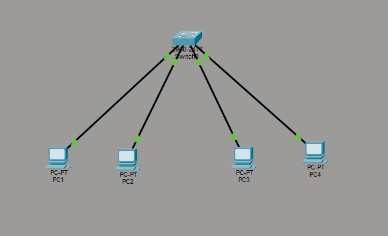
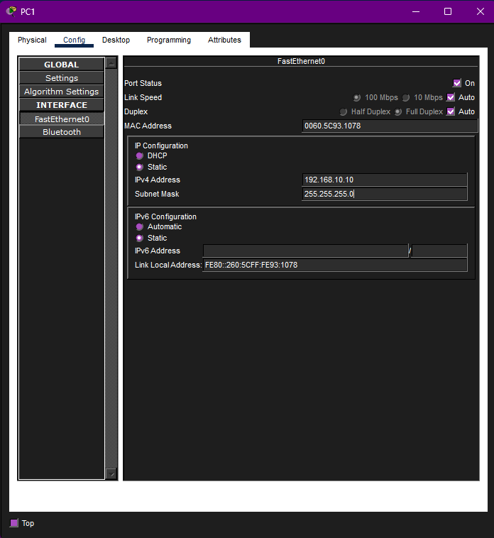
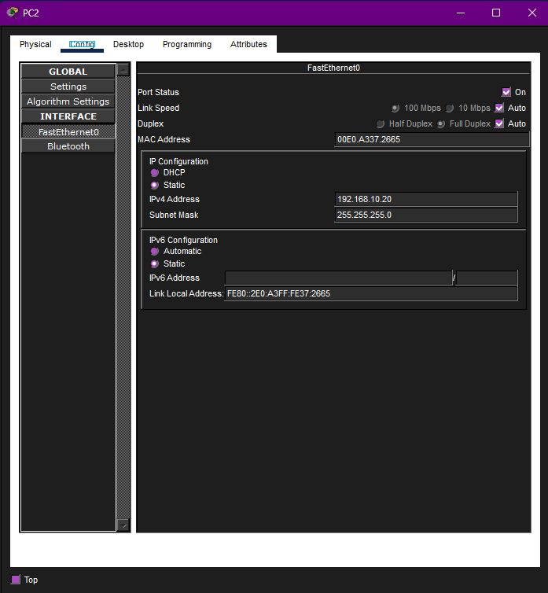
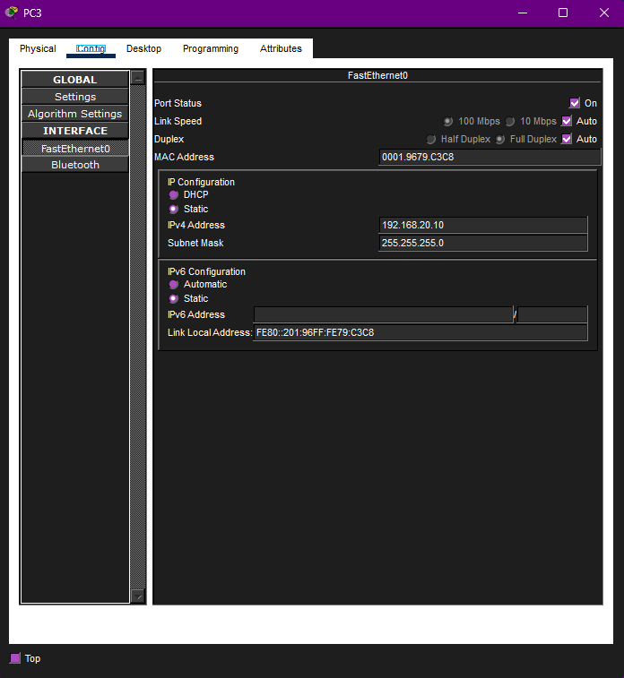
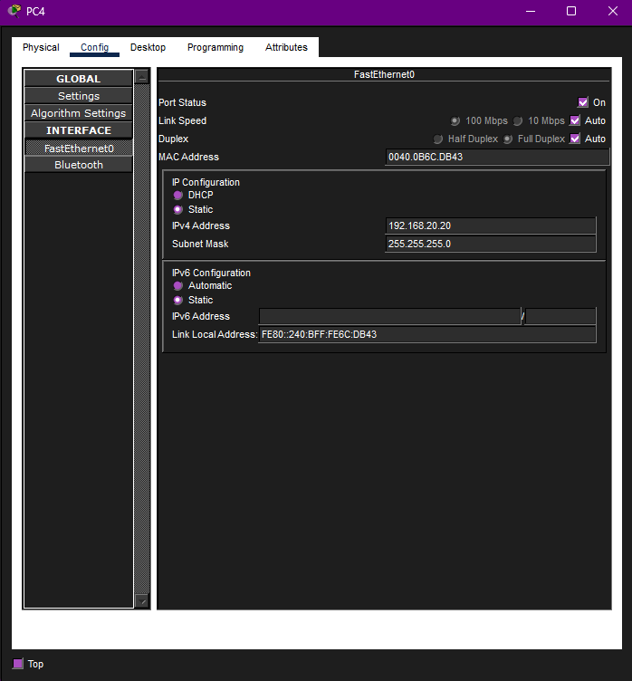
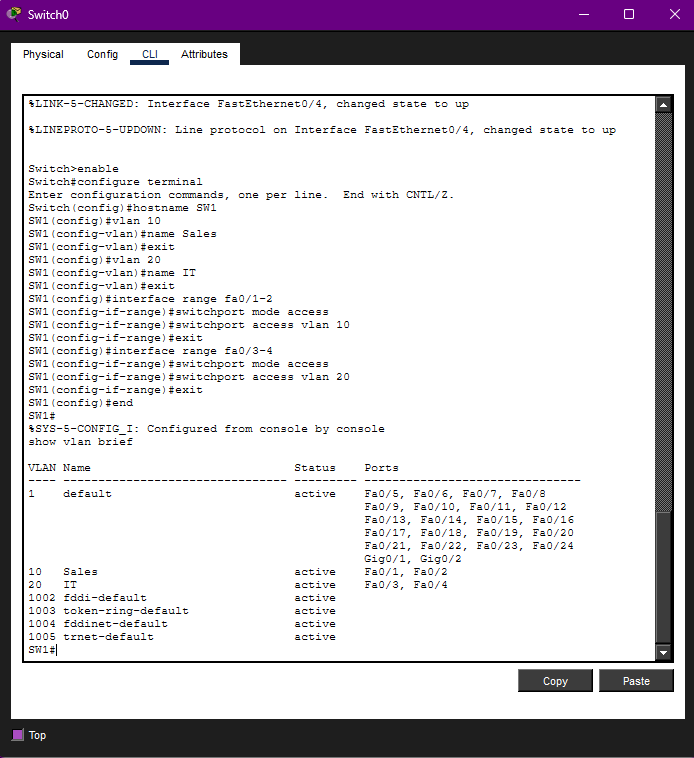
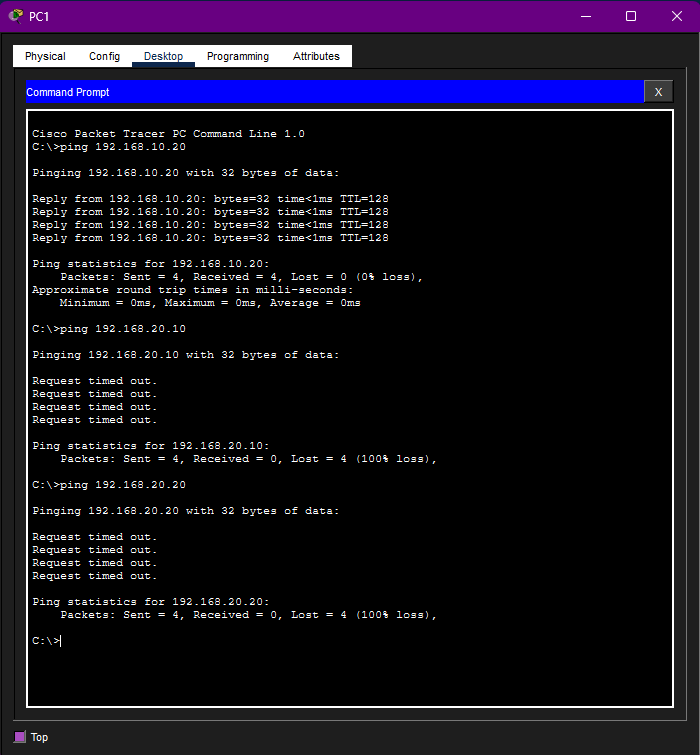
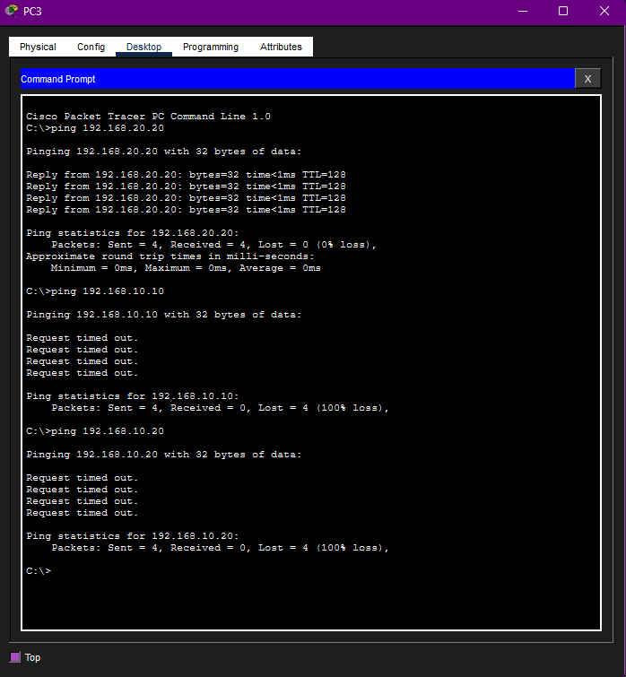

# VLAN Configuration Lab

## Overview

This lab demonstrates how to configure **Virtual LANs (VLANs)** on a Cisco switch in **Cisco Packet Tracer**. The purpose of this lab was to segment one physical switch into multiple logical networks and verify that devices in the same VLAN can communicate while devices in different VLANs remain separated.

This lab uses one switch and four PCs. No router is used in this lab because the goal is to demonstrate VLAN-based network segmentation, not inter-VLAN routing.

## Lab Objective

The objective of this lab was to:

- Build a basic switched network with four PCs
- Create VLAN 10 and VLAN 20 on a Cisco switch
- Assign switch access ports to the correct VLANs
- Configure static IP addresses on each PC
- Verify same-VLAN communication
- Confirm that devices in different VLANs cannot communicate without routing

## Network Topology



## Devices Used

| Device | Purpose |
|---|---|
| PC1 | End device assigned to VLAN 10 |
| PC2 | End device assigned to VLAN 10 |
| PC3 | End device assigned to VLAN 20 |
| PC4 | End device assigned to VLAN 20 |
| Switch 1 | Cisco switch used to create VLANs and assign access ports |

## VLAN Plan

| VLAN | Name | Assigned Devices | Switch Ports |
|---:|---|---|---|
| 10 | Sales | PC1, PC2 | Fa0/1, Fa0/2 |
| 20 | IT | PC3, PC4 | Fa0/3, Fa0/4 |

## IP Addressing Table

| Device | VLAN | IP Address | Subnet Mask | Default Gateway |
|---|---:|---:|---:|---|
| PC1 | 10 | 192.168.10.10 | 255.255.255.0 | N/A |
| PC2 | 10 | 192.168.10.20 | 255.255.255.0 | N/A |
| PC3 | 20 | 192.168.20.10 | 255.255.255.0 | N/A |
| PC4 | 20 | 192.168.20.20 | 255.255.255.0 | N/A |

A default gateway was not configured because this lab does not include a router or Layer 3 switch. Devices in different VLANs are expected to remain isolated.

## Configuration Steps

### 1. Built the Network Topology

I added four PCs and one Cisco switch in Packet Tracer. Each PC was connected to the switch using Ethernet connections.

The switch connections were organized so that PC1 and PC2 would later be assigned to VLAN 10, while PC3 and PC4 would be assigned to VLAN 20.

### 2. Configured PC1 and PC2

PC1 and PC2 were assigned IP addresses in the `192.168.10.0/24` network.





These two PCs were placed in the same subnet because they belong to the same VLAN.

### 3. Configured PC3 and PC4

PC3 and PC4 were assigned IP addresses in the `192.168.20.0/24` network.





These two PCs were placed in a separate subnet because they belong to VLAN 20.

### 4. Created VLANs on the Switch

I opened the switch CLI and created two VLANs:

- VLAN 10 named `Sales`
- VLAN 20 named `IT`

```bash
enable
configure terminal

hostname SW1

vlan 10
name Sales
exit

vlan 20
name IT
exit
```

### 5. Assigned Access Ports to VLANs

After creating the VLANs, I assigned the switch ports connected to PC1 and PC2 to VLAN 10.

```bash
interface range fa0/1 - 2
switchport mode access
switchport access vlan 10
exit
```

Then I assigned the switch ports connected to PC3 and PC4 to VLAN 20.

```bash
interface range fa0/3 - 4
switchport mode access
switchport access vlan 20
exit
```

I verified the VLAN configuration using:

```bash
end
show vlan brief
```



## Verification

### VLAN 10 Connectivity Test

PC1 and PC2 were both assigned to VLAN 10, so they should be able to communicate with each other.

I tested this by pinging between PC1 and PC2.



The successful ping confirms that devices in the same VLAN can communicate.

### VLAN 20 Connectivity Test

PC3 and PC4 were both assigned to VLAN 20, so they should also be able to communicate with each other.

I tested this by pinging between PC3 and PC4.



The successful ping confirms that VLAN 20 devices can communicate within their own VLAN.

## Expected Segmentation Behavior

Devices in different VLANs should not be able to communicate without a router or Layer 3 switch.

For example:

- PC1 should be able to ping PC2
- PC3 should be able to ping PC4
- PC1 should not be able to ping PC3
- PC2 should not be able to ping PC4

This behavior is correct because VLANs separate broadcast domains and segment the network.

## Troubleshooting Notes

If same-VLAN pings fail, the most likely causes are:

- Incorrect IP address or subnet mask
- PC connected to the wrong switch port
- Switch port assigned to the wrong VLAN
- VLAN not created correctly
- Cable/link not active

The `show vlan brief` command is useful because it confirms which switch ports are assigned to each VLAN.

## Skills Demonstrated

- Cisco Packet Tracer topology setup
- VLAN creation
- VLAN naming
- Access port configuration
- Static IP addressing
- Network segmentation
- Same-VLAN connectivity testing
- Basic switch troubleshooting
- Verification using `show vlan brief`

## Key Takeaways

This lab demonstrated that VLANs allow one physical switch to be divided into multiple logical networks. Devices in the same VLAN can communicate with each other, while devices in different VLANs are isolated unless routing is configured.

This is an important networking and cybersecurity concept because VLANs are commonly used to separate users, departments, servers, management interfaces, and sensitive systems.

## Security and Ethics Notice

This project was completed in a simulated lab environment using Cisco Packet Tracer. No real systems, public networks, or unauthorized devices were accessed.
