# Inter-VLAN Routing Lab

## Overview

This lab demonstrates how to configure **inter-VLAN routing** using the **router-on-a-stick** method in Cisco Packet Tracer.

In the previous VLAN lab, devices in different VLANs could not communicate because VLANs separate broadcast domains. In this lab, I added a router, configured a trunk link between the switch and router, created router subinterfaces, and assigned default gateways so devices in VLAN 10 and VLAN 20 could communicate.

## Lab Objective

The objective of this lab was to allow devices in separate VLANs to communicate through a router using one physical router interface and multiple subinterfaces.

This lab focused on:

- Creating VLANs on a switch
- Assigning switch access ports to VLANs
- Configuring a trunk port
- Creating router subinterfaces
- Assigning default gateways
- Testing same-VLAN and inter-VLAN communication

## Network Topology

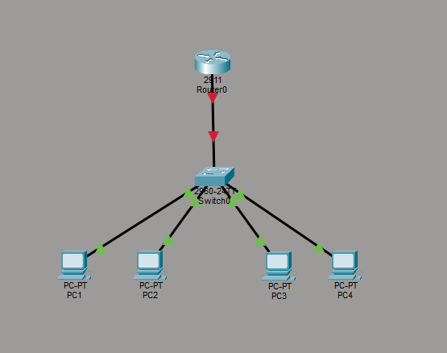

## Devices Used

| Device | Purpose |
|---|---|
| PC1 | End device in VLAN 10 |
| PC2 | End device in VLAN 10 |
| PC3 | End device in VLAN 20 |
| PC4 | End device in VLAN 20 |
| SW1 | Layer 2 switch used for VLAN access ports and trunking |
| R1 | Router used for inter-VLAN routing |

## VLAN Design

| VLAN | Name | Devices | Network |
|---:|---|---|---|
| 10 | Sales | PC1, PC2 | 192.168.10.0/24 |
| 20 | IT | PC3, PC4 | 192.168.20.0/24 |

## IP Addressing Table

| Device | VLAN | IP Address | Subnet Mask | Default Gateway |
|---|---:|---:|---:|---:|
| PC1 | 10 | 192.168.10.10 | 255.255.255.0 | 192.168.10.1 |
| PC2 | 10 | 192.168.10.20 | 255.255.255.0 | 192.168.10.1 |
| PC3 | 20 | 192.168.20.10 | 255.255.255.0 | 192.168.20.1 |
| PC4 | 20 | 192.168.20.20 | 255.255.255.0 | 192.168.20.1 |

## Router Subinterfaces

| Router Interface | VLAN | IP Address | Purpose |
|---|---:|---:|---|
| G0/0.10 | 10 | 192.168.10.1 | Default gateway for VLAN 10 |
| G0/0.20 | 20 | 192.168.20.1 | Default gateway for VLAN 20 |

## Configuration Steps

### 1. Assigned IP Addresses to VLAN 10 Devices

PC1 and PC2 were assigned IP addresses in the `192.168.10.0/24` network. Their default gateway was set to `192.168.10.1`, which is the router subinterface for VLAN 10.

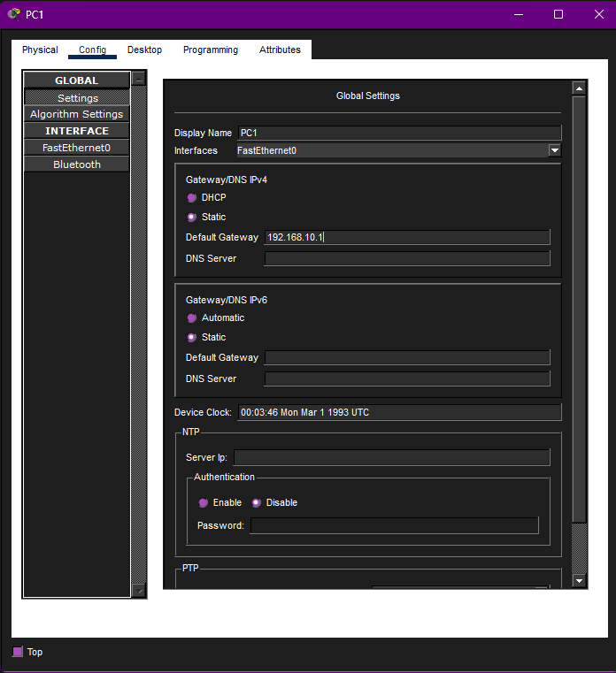

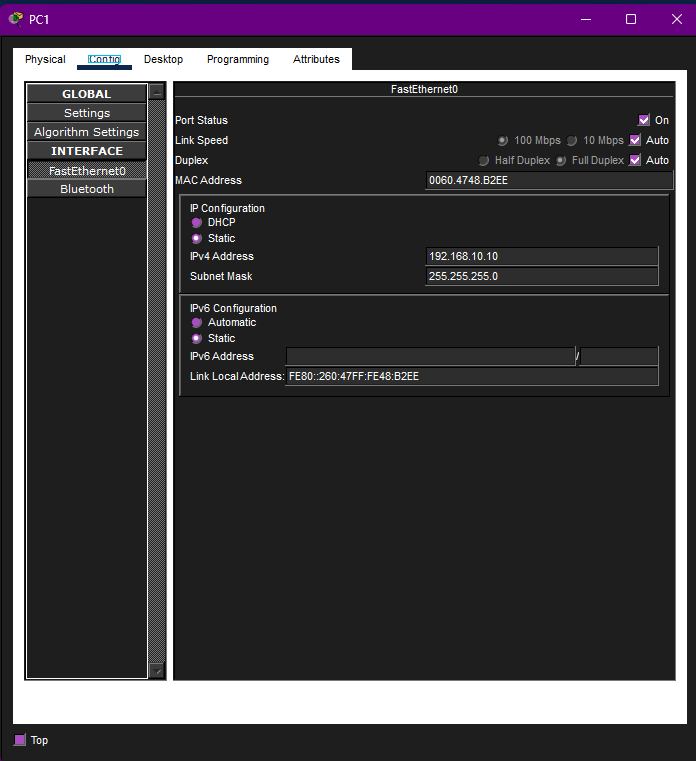

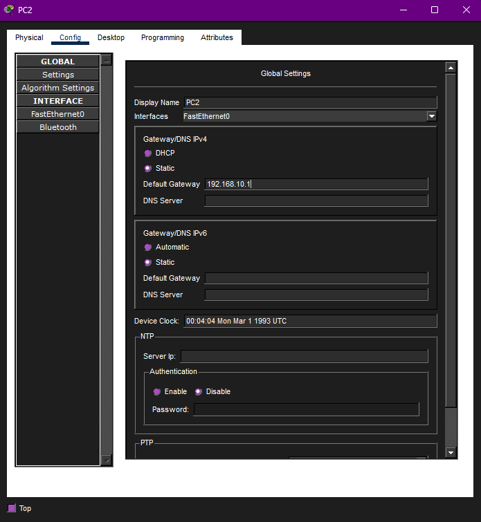

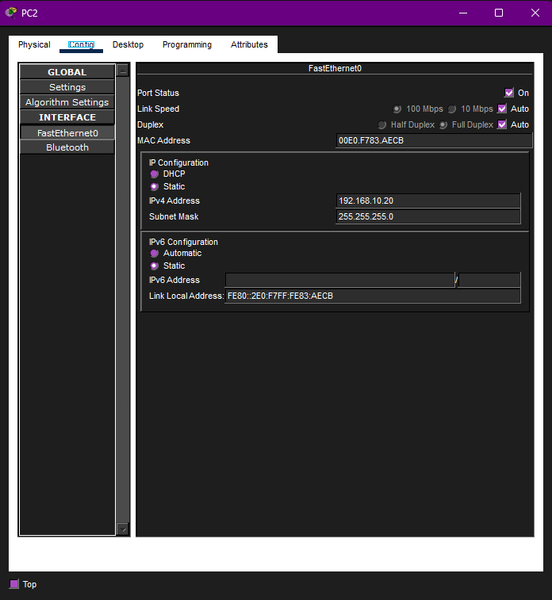

### 2. Assigned IP Addresses to VLAN 20 Devices

PC3 and PC4 were assigned IP addresses in the `192.168.20.0/24` network. Their default gateway was set to `192.168.20.1`, which is the router subinterface for VLAN 20.

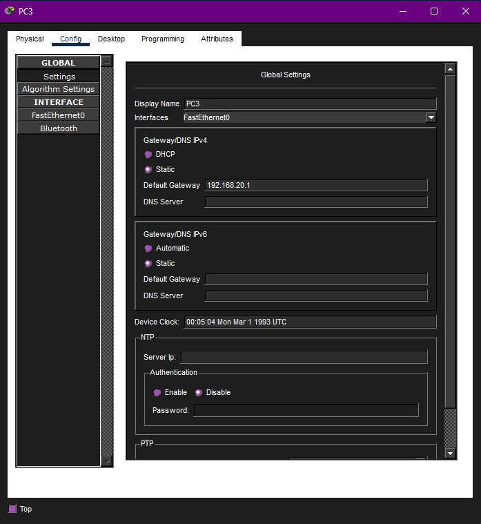

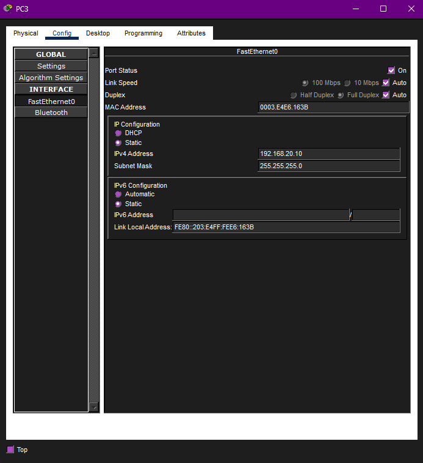

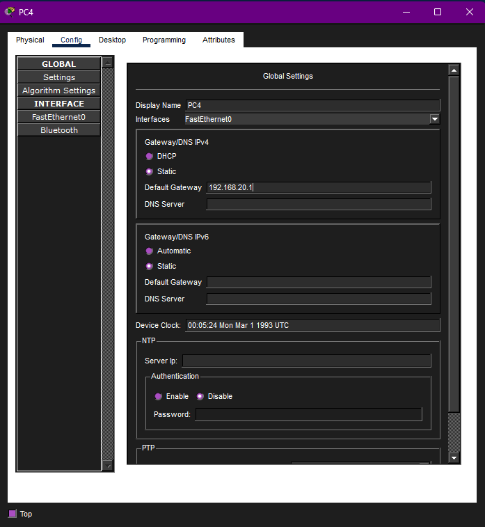

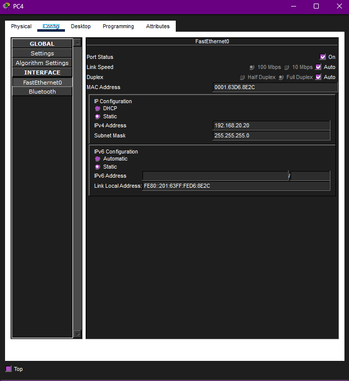

### 3. Configured VLANs and Access Ports on the Switch

On the switch, I created VLAN 10 and VLAN 20, then assigned the correct switch ports to each VLAN.

```bash
enable
configure terminal

hostname SW1

vlan 10
name Sales
exit

vlan 20
name IT
exit

interface range fa0/1 - 2
switchport mode access
switchport access vlan 10
exit

interface range fa0/3 - 4
switchport mode access
switchport access vlan 20
exit

end
show vlan brief
```

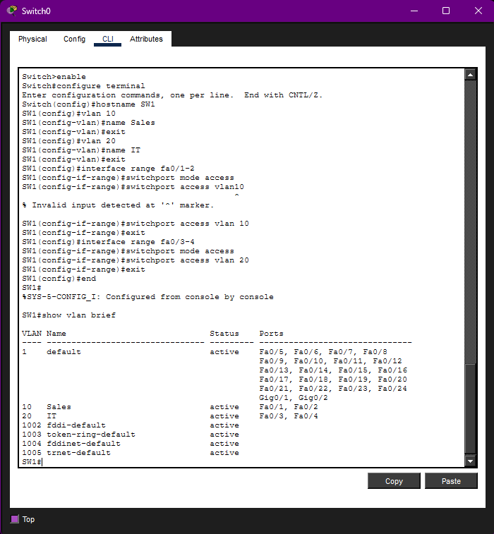

### 4. Verified VLAN Segmentation Before Routing

Before configuring router-on-a-stick, devices in different VLANs could not communicate. This was expected because VLAN 10 and VLAN 20 were separated at Layer 2.

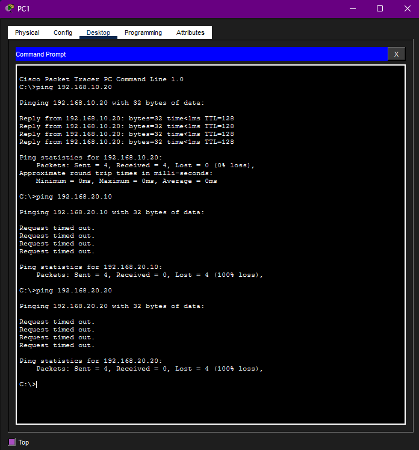

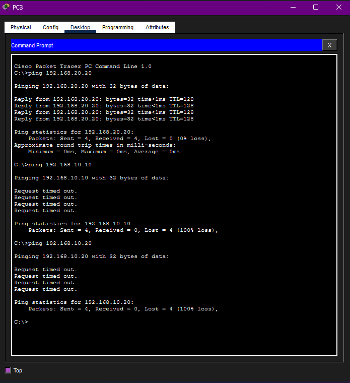

The failed ping confirmed that VLAN segmentation was working.

### 5. Configured Router Subinterfaces

Router subinterfaces were created so one physical router interface could route traffic for multiple VLANs.

```bash
enable
configure terminal

hostname R1

interface g0/0
no shutdown
exit

interface g0/0.10
encapsulation dot1Q 10
ip address 192.168.10.1 255.255.255.0
exit

interface g0/0.20
encapsulation dot1Q 20
ip address 192.168.20.1 255.255.255.0
exit

end
show ip interface brief
```

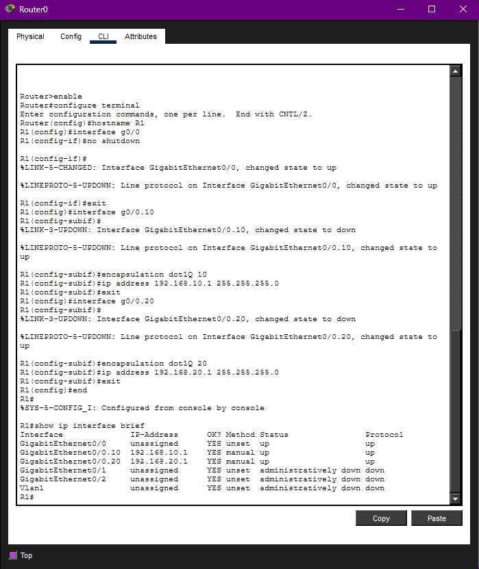

### 6. Configured the Switch Trunk Port

The switch port connected to the router was configured as a trunk port. This allows VLAN 10 and VLAN 20 traffic to pass between the switch and router over the same physical link.

```bash
configure terminal

interface fa0/24
switchport mode trunk
exit

end
show interfaces trunk
```

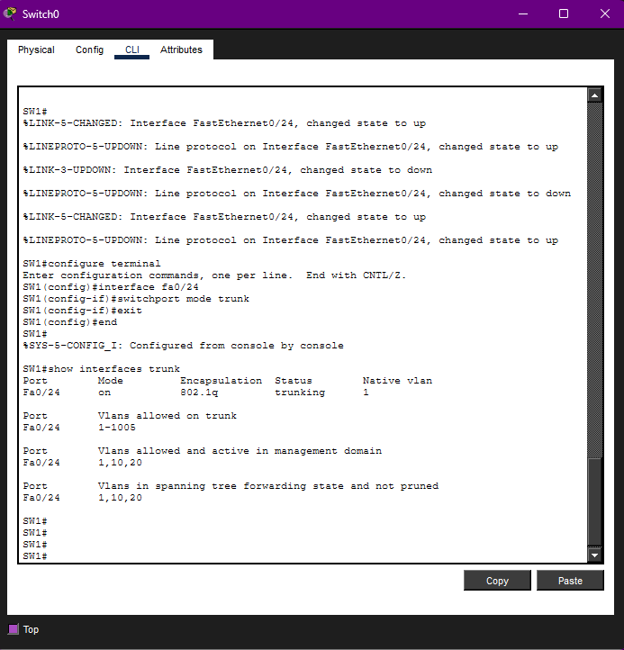

### 7. Tested Inter-VLAN Connectivity

After configuring the router subinterfaces and trunk port, devices in different VLANs were able to communicate successfully.

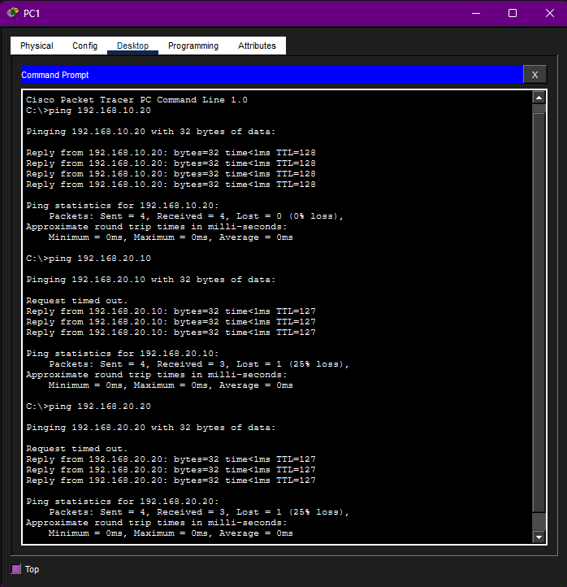

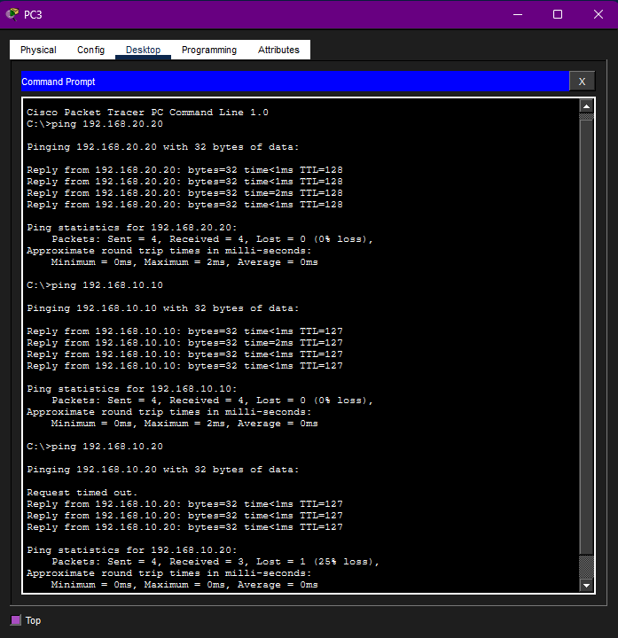

The first ping attempt may time out because of ARP resolution. This is normal in Packet Tracer. The important result is that the following replies succeed.

## Verification

The lab was successful because:

- VLAN 10 and VLAN 20 were created.
- PC ports were assigned to the correct VLANs.
- The switch-to-router link was configured as a trunk.
- Router subinterfaces were configured with 802.1Q encapsulation.
- PCs used the router subinterfaces as their default gateways.
- Devices in different VLANs were able to ping each other.

## Troubleshooting Notes

During this lab, `show interfaces trunk` may show nothing if the trunk is not active. Common causes include:

- The wrong switch port was configured as the trunk.
- The router interface connected to the switch was shut down.
- The router subinterfaces were configured on the wrong physical interface.
- The cable was connected to a different router port than expected.

The fix is to verify the physical connection, make sure the switch trunk port matches the connected interface, and confirm that the router physical interface is enabled with `no shutdown`.

## Skills Demonstrated

- VLAN creation
- Access port configuration
- Trunk port configuration
- Router-on-a-stick configuration
- 802.1Q encapsulation
- Default gateway configuration
- Inter-VLAN routing
- Cisco IOS CLI troubleshooting
- Connectivity testing with `ping`

## Key Takeaways

This lab showed that VLANs separate networks by default. Devices in different VLANs cannot communicate unless routing is configured.

Router-on-a-stick allows one router interface to route traffic for multiple VLANs by using subinterfaces and 802.1Q tagging. The switch trunk carries traffic from multiple VLANs to the router, and the router sends traffic between those VLANs using the correct default gateway addresses.

## Security and Ethics Notice

This project was completed in a simulated lab environment using Cisco Packet Tracer. No real systems, public networks, or unauthorized devices were accessed.
